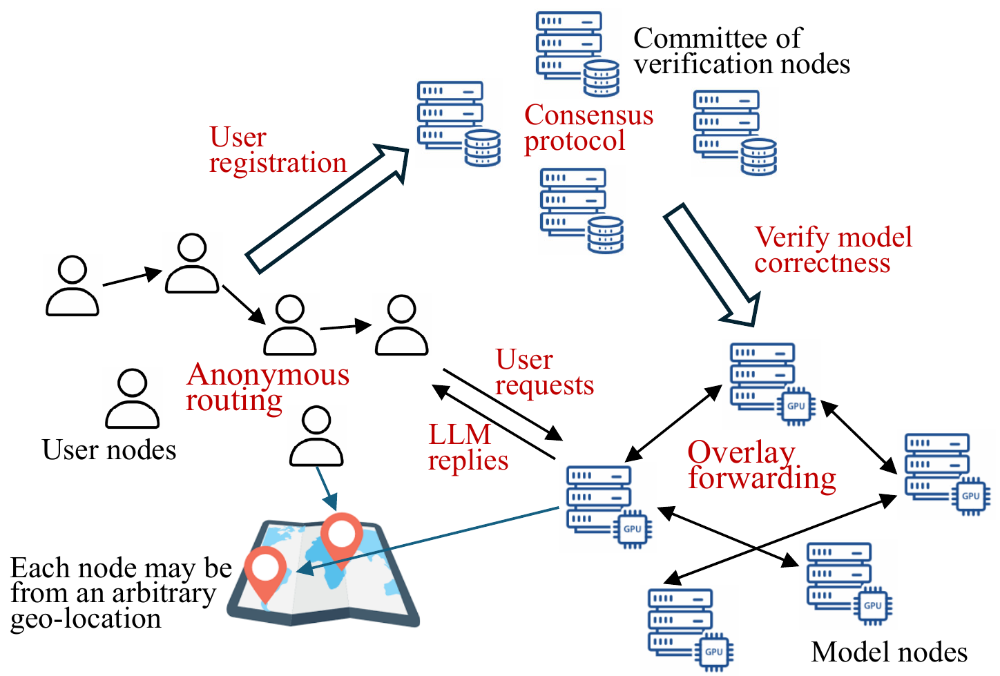

## PlanetServe: A Decentralized, Scalable, and Privacy-Preserving Overlay for Democratizing Large Language Model Serving 

<p align="center">
  <a href="https://secartifacts.github.io/usenixsec2025/badges">
    
  </a>
  <a href="https://secartifacts.github.io/usenixsec2025/badges">
    
  </a>
  <a href="https://secartifacts.github.io/usenixsec2025/badges">
    
  </a>
</p>

Welcome to **PlanetServe**, an Open LLM serving overlay that harnesses computing resources from decentralized contributors.

## 📃 Overview





```
.
├── build/                   # Build files
├── CMakeLists.txt           # CMake configuration
├── configs/                 # Configuration files for local testing
├── demo/                    # Hard-coded local demo examples
├── deps/                    # Third-party dependencies
├── docs/                    # figures, and demo GIFs
├── eval/                    # Reproduction and evaluation instructions
│   ├── hrt+lb/              # Hash Radix Tree + load-balancing experiments
│   ├── malicious_frac/      # Malicious fraction simulation
│   ├── prep_decry_lat/      # Prepare/decrypt latency measurements
│   ├── verification/        # Verification prototype
│   └── workload/            # Workload driver & monitor
├── models/                  # Model files (e.g., .gguf)
├── planetllm_tendermint/    # Tendermint-based consensus demo for verification committee
├── README.md                # Project overview
├── scripts/                 # Scripts to run local demos
├── src/                     # Core demo system implementation
└── tests/                   # tests
```

## 📚 Repository Overview

This repository is organized into several modules.  
Each directory includes its own `README.md` with detailed documentation.

### Demo

- **[`demo/`](demo/README.md)**  
  Local demos that showcase the PlanetServe system design by running multiple logical nodes on a single machine, without requiring GPU.

### Evaluation

- **eval/**  
  Scripts and configurations for evaluation.

  - **[`hrt+lb/`](eval/hrt+lb/README.md)**  
    Experiments on Hash Radix Tree + load-balancing and Confidemtial Computing.

  - **[`malicious_frac/`](eval/malicious_frac/README.md)**  
    Simulation of anonimity and confidentiality under different fractions of malicious nodes.

  - **[`prep_decry_lat/`](eval/prep_decry_lat/README.md)**  
    Microbenchmarks measuring preparation and decryption latency.

  - **[`verification/`](eval/verification/README.md)**  
    Prototype for verification logic.

  - **[`workload/`](eval/workload/README.md)**  
    Prototype for scheduling and load balancing logic.

## Citation

If you use PlanetServe in your research, please cite:

```bibtex
@inproceedings{fang2026planetserve,
  title     = {PlanetServe: A Decentralized, Scalable, and Privacy-Preserving Overlay for Democratizing Large Language Model Serving},
  author    = {Fang, Fei and Hua, Yifan and Wang, Shengze and Zhou, Ruilin and Liu, Yi and Qian, Chen and Zhang, Xiaoxue},
  booktitle = {Proceedings of the 23rd USENIX Symposium on Networked Systems Design and Implementation (NSDI '26)},
  year      = {2026},
  address   = {Renton, WA, USA},
  month     = may,
}

@misc{fang2025planetserve_arxiv,
  title         = {PlanetServe: A Decentralized, Scalable, and Privacy-Preserving Overlay for Democratizing Large Language Model Serving},
  author        = {Fang, Fei and Hua, Yifan and Wang, Shengze and Zhou, Ruilin and Liu, Yi and Qian, Chen and Zhang, Xiaoxue},
  year          = {2025},
  eprint        = {2504.20101},
  archivePrefix = {arXiv},
  primaryClass  = {cs.DC},
  doi           = {10.48550/arXiv.2504.20101}
}
