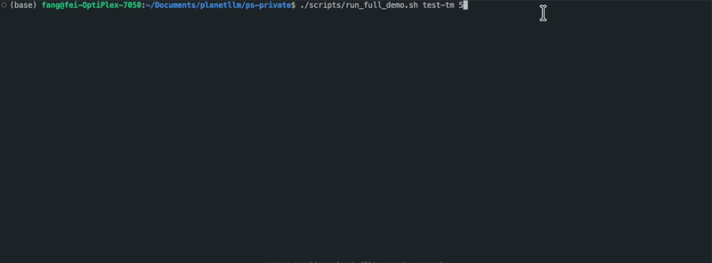

# PlanetServe Demo (Hard-coded, Local Prototype) 
We provide a locally testable PlanetServe demo that demonstrates LLM inference over an S-IDA multi-path relay network, together with Tendermint BFT–based reputation verification.

⚠️ Important note:
This demo is hard-coded and not fully automated.  Due to the **substantial resource requirements of deploying a full P2P overlay network** (e.g., GPU resources, multiple relay nodes...), we provides a **lightweight, locally testable prototype**. It is designed to **serve as a reference prototype for future real-world deployments**, rather than as a ready implementation.

### User Prompt Workflow
A single user prompt is split into multiple “cloves” and forwarded through four independent relay paths before reaching the Model Node. The response is relayed back along the same paths.

For simplicity and reproducibility:
- All relay paths and port assignments are hard-coded
- Node placement and routing logic are fixed
- User nodes do not dynamically register their IP addresses or public keys with verification nodes

### Verification Workflow
1. Verification Node sends a challenge prompt to the Model Node via S-IDA
2. The Model Node generates a response using llama.cpp
3. The response is relayed back through S-IDA to the Verification Node
4. The Verification Node computes a credibility score using llama.cpp
5. The verification result is submitted to a Java-based Tendermint node via HTTP
6. Tendermint BFT reaches consensus on the reputation update
   (Note: reputation update execution is not fully tested in this demo)

### Limitations and Open Questions

- Automatic reputation update execution is not fully provided in this demo
- When scaling up, the responsibility for automatic challenge generation and credibility computation has not yet been finalized (i.e., whether these tasks should be handled entirely within Tendermint or by Verification Nodes and then submitted)

### Test Instruction

#### Dependencies

```bash
sudo apt update
sudo apt install -y \
    build-essential \
    cmake \
    libssl-dev \
    libzmq3-dev \
    nlohmann-json3-dev
git submodule update --init --recursive

cd ../deps/llama.cpp
cmake -S . -B build \
  -DCMAKE_BUILD_TYPE=Release \
  -DLLAMA_BUILD_TESTS=OFF \
  -DLLAMA_BUILD_EXAMPLES=OFF
cmake --build build -j
cd ../../
```
Use CPU by default for local test.

#### Model Download

```bash
brew install huggingface-cli
cd ../..
mkdir -p models && cd models
hf download bartowski/Llama-3.2-1B-Instruct-GGUF \
  --include "Llama-3.2-1B-Instruct-Q4_K_M.gguf" \
  --local-dir ./
```

#### Run the Demo

##### Build

```bash
./scripts/run_full_demo.sh build
```

##### Start All Nodes

```bash
./scripts/run_full_demo.sh start
```


##### test user prompt

```bash
./scripts/run_full_demo.sh user --prompt "What is the capital of France?"
```


##### Run Verification

Single challenge:

```bash
./scripts/run_full_demo.sh verifier --challenge "What is 2+2?"
```
Multiple challenges (e.g., 5):

```bash
 ./scripts/run_full_demo.sh test 5
```


> **Note:** Automatic challenge generation by the LLM is not enabled in this demo; challenge prompts are provided manually.

##### Stop All Services

```bash
./scripts/run_full_demo.sh stop
```