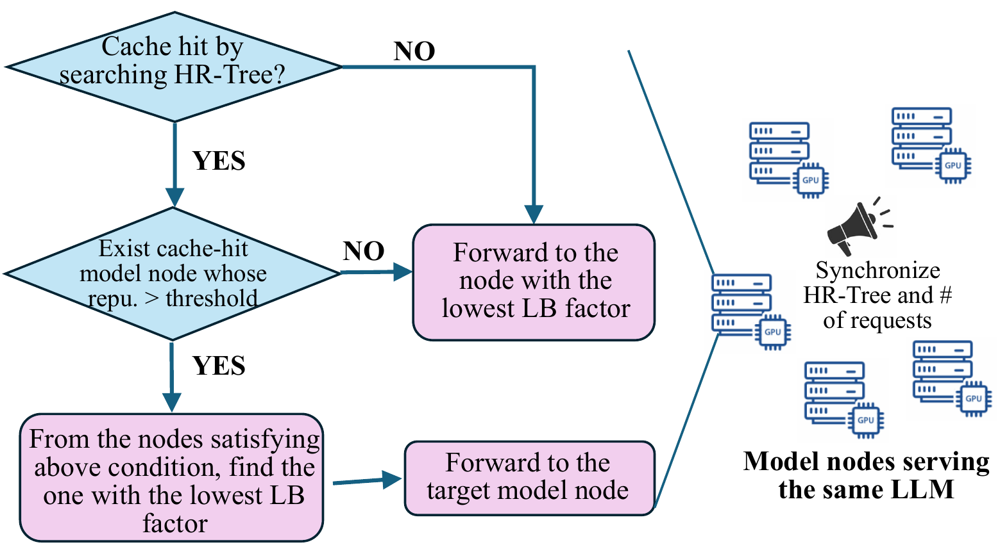

## Ablation study of latency



We conduct an ablation study on end-to-end latency using 8 NVIDIA A100 GPUs, configured as 8 independent model nodes, each running Llama-3.1-8B.

### Model Download

Access to Llama models requires accepting the Meta Llama license on Hugging Face. Please ensure that you have applied for and agreed to the license, and that you are logged in locally or have provided a valid Hugging Face access token.

``` bash
pip install -U "huggingface_hub[cli]"
hf login
hf download meta-llama/Llama-3.1-8B --local-dir ./Llama-3.1-8B --local-dir-use-symlinks False
```
### Dataset Download

The evaluation dataset can be downloaded using gdown
``` bash
mdkir -p ../../datasets
cd ../../datasets 
pip install -U gdown
gdown --id 1yEDzM3uKDgtnE2vk9LNWCk6xQdz-STCn
```

### environment
``` bash
conda env create -f environment.yml
conda activate llm310
```
### run experiments
We evaluate three configurations:
1. vanilla_vllm_v0.py: vLLM baseline (no HR-Tree, no load balancing)
2. local_hrt_vllm_wo_lb.py: HR-Tree enabled, without load balancing
3. local_hrt_vllm.py: HR-Tree + load balancing (full)

First, start the model servers:
``` bash
sudo chmod +x start_server.sh
./start_server.sh
```
Then run the desired experiment:
``` bash
python <vanilla_vllm_v0.py | local_hrt_vllm_wo_lb.py | local_hrt_vllm.py> \
  --model-name meta-llama/Llama-3.1-8B-Instruct \
  --max-model-concurrency 4 \
  --sched-workers 1 \
  --serve-workers 256 \
  --request-rate 72 \
  --dataset-path ../datasets/toolbench_zipf_1.1_prompts_6000.jsonl
```
After completing the experiments, stop all running model servers:
``` bash
sudo chmod +x end_server.sh
./end_server.sh
```

## Latency of Confidential Computing

For confidential computing, we evaluate a single configuration using the vanilla vLLM baseline: vanilla_vllm_v0.py: vLLM baseline (no HR-Tree, no load balancing)

The experiment is conducted on Azure Standard NCC40ads H100 v5 Confidential VMs (CC-on) and the corresponding Standard NC40ads H100 v5 VMs (CC-off).
Both configurations provide identical hardware resources (1× NVIDIA H100 GPU, 40 vCPUs, 320 GB RAM), except that the CC-on VM enables confidential computing features.

``` bash
python vanilla_vllm_v0.py \
  --model-name meta-llama/Llama-3.1-8B-Instruct \
  --max-model-concurrency 4 \
  --sched-workers 1 \
  --serve-workers 256 \
  --request-rate 20 \
  --dataset-path ../datasets/toolbench_zipf_1.1_prompts_6000.jsonl
  ```

Note that the confidential computing experiment does not introduce any new system components. It is a direct comparison using the same vanilla vLLM implementation under CC-on and CC-off hardware settings.