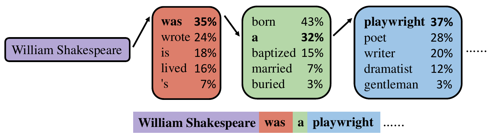

# Verification for the model node challenge response



### dependency
#### llama.cpp
``` bash
brew install llama.cpp
```


#### Model Download

Install the Hugging Face CLI and download all required GGUF models.

```bash
brew install huggingface-cli
cd ../..
mkdir -p models && cd models
```

##### Ground-Truth Model
```bash
hf download bartowski/Meta-Llama-3.1-8B-Instruct-GGUF \
  --include "Meta-Llama-3.1-8B-Instruct-Q4_K_M.gguf" \
  --local-dir ./
```

#### Candidate Models

**m1 — Llama-3.2-3B (Q4_K_M)**
```bash
hf download bartowski/Llama-3.2-3B-Instruct-Q4_K_M \
  --include "Llama-3.2-3B-Instruct-Q4_K_M.gguf" \
  --local-dir ./
```

**m2 — Llama-3.2-1B (Q4_K_M)**
```bash
hf download bartowski/Llama-3.2-1B-Instruct-GGUF \
  --include "Llama-3.2-1B-Instruct-Q4_K_M.gguf" \
  --local-dir ./
```

**m3 — Llama-3.2-1B (Q4_K_S)**
```bash
hf download bartowski/Llama-3.2-1B-Instruct-GGUF \
  --include "Llama-3.2-1B-Instruct-Q4_K_S.gguf" \
  --local-dir ./
```

**m4 — Llama-3.2-3B (Q4_K_S)**
```bash
hf download bartowski/Llama-3.2-3B-Instruct-GGUF \
  --include "Llama-3.2-3B-Instruct-Q4_K_S.gguf" \
  --local-dir ./
```
#### prepare responses
First generate responses for different model/using different example prompts

#### run groundtruth model
``` bash
llama-server -m Meta-Llama-3.1-8B-Instruct-Q4_K_M.gguf --port 8080
```

python
``` bash
pip install scipy requests
```
run eval script
``` bash
python verify.py
```

